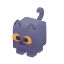

# DesktopPet

A small wandering 3D pet that lives on your Windows desktop. Comes with cube animals that roam every connected monitor, play fetch with a draggable ball, and chase your cursor — plus a window-aware zombie that walks along your window edges, climbs them, and tumbles when the floor disappears.



## What it does

**Two flavors of pet, switchable from the tray menu:**

### Cube Pets (24 animals)
- Floats above all other windows, click-through so it never gets in your way
- **25 different idle/wander behaviors** the pet uniformly picks between when nothing else is happening — Wander, Patrol, Pace, Circle, Figure-8, Zigzag, Sprint, Sneak, Perimeter walk, Corner visit, Tiptoe, Lap, Spin, Reverse spin, Look around, Head shake, Stare at corner, Sit, Stretch, Sneeze, Groom, Yawn, Bow, Pounce, and Spook
- Chases your cursor when it's moving and far away — pauses briefly when it catches it
- Once a minute, a catch triggers `eat` + `dance` animations
- **Plays fetch** with a draggable ball (see below)
- After 60 seconds of cursor idle, walks back to the cursor and lies down to sleep
- Sleeping pet gets floating animated Z's and occasional dream-twitches

### Characters
- **Zombie** (skinned humanoid)
- Recognizes top edges of other windows as ground; walks along them
- Falls when a window moves out from under it — tumble animation while airborne
- **Climbs** vertical window edges (~85% chance at a viable edge) with a ~12%/sec grip-loss chance that drops him mid-climb into a fall. Spontaneous climbing on the desktop floor is boosted 2.5×, so he eventually goes climbing on his own
- Hard landings end in a faceplant + head-shake recovery (procedural animations)
- Walk speed scales with pet size so the run cycle matches forward motion

### Ball minigame

Toggle **Show ball** in the tray to spawn a draggable red ball window. It's the only interactive part — the pet stays click-through.

- **Drag** the ball anywhere with the mouse; release at rest to drop, or release with motion to throw
- Throw physics: gravity 1400, air drag, 0.55 bounce damping, ground friction
- The cube pet sees a **Free** or **Thrown** ball and runs to fetch it
- On contact (size-aware catch radius so it works at every pet size), the pet grabs the ball and runs it back to your cursor, then drops it
- The Zombie ignores the ball

### Multi-monitor

The pet and ball use the union of all `Screen.AllScreens` working areas, so they can roam across every connected display.

## Installing (end users)

Grab `DesktopPet-Setup-<version>.exe` from [Releases](https://github.com/SixOfFive/DesktopPet/releases) and run it. The installer is self-contained — no .NET runtime required on the target machine.

During install you can opt in to:
- A desktop shortcut
- **Launch on Windows startup** (creates a shortcut in your user Startup folder)

Right-click the tray icon → **Exit** to quit. Uninstall from Settings → Apps as usual.

**Size**: the tray menu has a `Size` submenu with Half / Regular / Double options that stack multiplicatively (Double → Double = ×4). Range is 32 px to 512 px. The current size, last-selected pet, and the ball-visibility toggle all persist between runs in `%LocalAppData%\Neko\settings.json`.

## Running from source

Requires the **.NET 9 SDK**.

```powershell
dotnet run
```

## Building the installer

Requires **Inno Setup 6** ([download](https://jrsoftware.org/isdl.php) or `winget install JRSoftware.InnoSetup`).

```powershell
pwsh -File build-installer.ps1
```

This runs `dotnet publish` then `iscc.exe installer.iss`. Output: `dist\DesktopPet-Setup-<version>.exe` (~33 MB).

## Building just the executable

```powershell
dotnet publish -c Release
```

Output: `bin\Release\net9.0-windows\win-x64\publish\Neko.exe` plus `glfw3.dll` — the GLFW native sits loose next to the exe and must travel with it, since Silk.NET loads it via DllImport rather than the bundled-native-libs extraction path that `IncludeNativeLibrariesForSelfExtract` handles.

## Picking a different pet

Right-click the tray icon → **Pets** for the 24 cube animals (beaver, bee, bunny, cat, caterpillar, chick, cow, crab, deer, dog, elephant, fish, fox, giraffe, hog, koala, lion, monkey, panda, parrot, penguin, pig, polar bear, tiger) — or **Characters → Zombie** to switch to the window-walking humanoid.

## Custom textures

Every cube pet samples colors from a shared 512×512 palette (`colormap.png`). You can recolor one pet without affecting the others by dropping PNGs named `<modelname>-<variant>.png` in the [`skins/`](skins/) folder. The build copies them next to the GLB at compile time and the tray menu turns any pet with one or more variants into a submenu: **Default** (the original Kenney colormap) plus one entry per variant.

To add your own:
1. Copy `kenney_cube-pets_1.0/Models/GLB format/Textures/colormap.png` to `skins/<modelname>-<variant>.png` (e.g. `animal-cat-charlie.png`).
2. Open it in any image editor (512×512, a 4×4 grid of 128×128 cells).
3. Modify the cells the model uses (each pet only samples a couple — look at the GLB's UV ranges or edit-and-iterate).
4. Rebuild and select the variant from the tray submenu for that pet.


## How it works

**Rendering pipeline** (every 16 ms):

```
Pet state + behavior → 3D scene → offscreen FBO → glReadPixels → UpdateLayeredWindow
```

A hidden Silk.NET OpenGL 3.3 context renders the model into an offscreen framebuffer. The frame is read back, Y-flipped, alpha-premultiplied, and pushed onto a `WS_EX_LAYERED | WS_EX_TRANSPARENT` window via `UpdateLayeredWindow` — giving true per-pixel transparency without GPU-window-compositing headaches.

**Two model paths share the same Scene:**
- **Rigid-node animation** (cube pets) — each leg/tail/body is its own mesh on its own node, animation channels move the nodes. Built with a simple lambert vertex shader.
- **Skinned mesh animation** (zombie) — single mesh with per-vertex joint indices and weights, 64-bone palette uploaded as a uniform array, skinning math in a second vertex shader. Also supports **procedural animations** layered on top of rest-pose TRS for clips not in the source pack (Fall, FacePlant, HeadShake, Climb).

**Behaviors are pluggable** (`IPetBehavior`):
- `Pet` (FreeWander) — 25-action idle state machine, cursor chase, sleep cycle, ball fetch
- `WindowWalker` — gravity-based physics + ground search via `EnumWindows` + `GetWindowRect`

**Source layout**

| File | Role |
|---|---|
| [Program.cs](Program.cs) | Entry point — discovers models, builds tray groups, wires events, ball lifecycle |
| [Pet.cs](Pet.cs) | FreeWander state machine — 25 idle actions, cursor chase, sleep cycle, ball fetch/return |
| [WindowWalker.cs](WindowWalker.cs) | Gravity, ground search, climb, faceplant recovery |
| [WindowEnumerator.cs](WindowEnumerator.cs) | Win32 `EnumWindows` + cloak/minimize/size filters |
| [LayeredPetForm.cs](LayeredPetForm.cs) | Transparent click-through topmost window, `UpdateLayeredWindow`, multi-monitor screen-area union |
| [BallForm.cs](BallForm.cs) | Draggable layered ball window with throw physics + pet-fetch handoff |
| [TrayIcon.cs](TrayIcon.cs) | System tray with grouped submenus (Pets / Characters / Size / Show ball) |
| [Settings.cs](Settings.cs) | JSON persistence under `%LocalAppData%\Neko\settings.json` |
| [IPetBehavior.cs](IPetBehavior.cs) | Behavior interface implemented by `Pet` and `WindowWalker` |
| [ZParticles.cs](ZParticles.cs) | Floating Z's overlay drawn on the bitmap during sleep |
| [Renderer/GlHost.cs](Renderer/GlHost.cs) | Hidden Silk.NET window + OpenGL 3.3 context |
| [Renderer/Scene.cs](Renderer/Scene.cs) | FBO, both shader paths, render-and-readback, state→clip mapping |
| [Renderer/GltfLoader.cs](Renderer/GltfLoader.cs) | Cube-pet (rigid-node) loader, SharpGLTF → GPU |
| [Renderer/SkinnedLoader.cs](Renderer/SkinnedLoader.cs) | Humanoid loader, multi-GLB animation merging, skin texture |
| [Renderer/AnimatedModel.cs](Renderer/AnimatedModel.cs) | Rigid-node model + sampler-based animation playback |
| [Renderer/SkinnedModel.cs](Renderer/SkinnedModel.cs) | Skinned model + bone palette + procedural animation dispatch |
| [Renderer/ProceduralAnimations.cs](Renderer/ProceduralAnimations.cs) | Fall, Climb, FacePlant, HeadShake — direct bone TRS manipulation |
| [Renderer/Shader.cs](Renderer/Shader.cs) | Shader program wrapper, uniform cache |
| [Renderer/Mesh.cs](Renderer/Mesh.cs) | Cube-pet VAO/VBO/EBO |
| [Renderer/Texture.cs](Renderer/Texture.cs) | GL texture wrapper |

## Dependencies

- [Silk.NET](https://github.com/dotnet/Silk.NET) — OpenGL bindings, hidden window
- [SharpGLTF](https://github.com/vpenades/SharpGLTF) — glTF 2.0 / GLB loading and animation curves
- [FBX2glTF](https://github.com/facebookincubator/FBX2glTF) (build-time only) — converted Kenney's retro-characters FBX into GLB
- WinForms — host window, system tray, timer

## Roadmap

- [x] Climb behavior — detect vertical window edges, climb up them, fall when out of grip *(v1.1)*
- [x] Tray submenu for size with persistent settings *(v1.1)*
- [x] Ball minigame — drag, throw, pet fetches and returns to cursor *(v1.2)*
- [x] 25 idle/wander behaviors instead of walk-or-idle coin flip *(v1.2)*
- [x] Multi-monitor support — union of all `Screen.AllScreens` working areas *(v1.2)*
- [ ] More zombie skin variants (human male/female, zombie female) as separate tray entries
- [ ] Click-to-pet interaction (handle mouse events without breaking click-through)
- [ ] Mixamo animation grafting for richer character clips
- [ ] Sleeping-eyes texture variant for cube pets (half-closed eye trick)
- [ ] Zombie joins the ball minigame

## Credits & licenses

All bundled 3D assets are **CC0 1.0** (public domain) — free for personal, educational, and commercial use without attribution required. Credits provided here as courtesy.

- **Kenney Cube Pets** — Created and distributed by [Kenney](https://kenney.nl) under [CC0 1.0](https://creativecommons.org/publicdomain/zero/1.0/). Included in [`kenney_cube-pets_1.0/`](kenney_cube-pets_1.0/) with the original `License.txt`. Source: <https://kenney.nl/assets/cube-pets>.
- **Kenney Animated Characters Retro** — Created and distributed by [Kenney](https://kenney.nl) under [CC0 1.0](https://creativecommons.org/publicdomain/zero/1.0/). The Zombie character (mesh + idle/jump/run animations + skin textures) is from this pack. Included in [`kenney_animated-characters-retro/`](kenney_animated-characters-retro/) with the original `License.txt`. Source: <https://kenney.nl/assets/animated-characters-retro>.
- **Project code** — see repo license.
